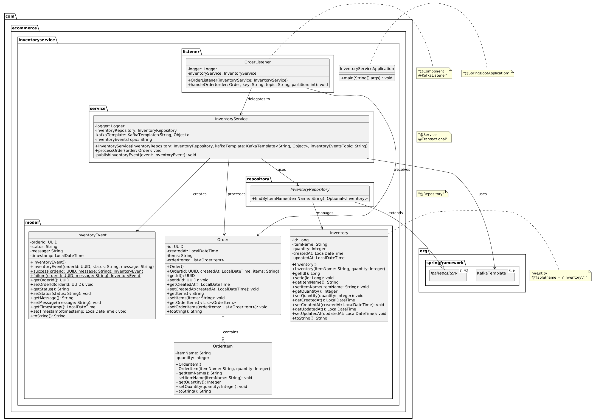
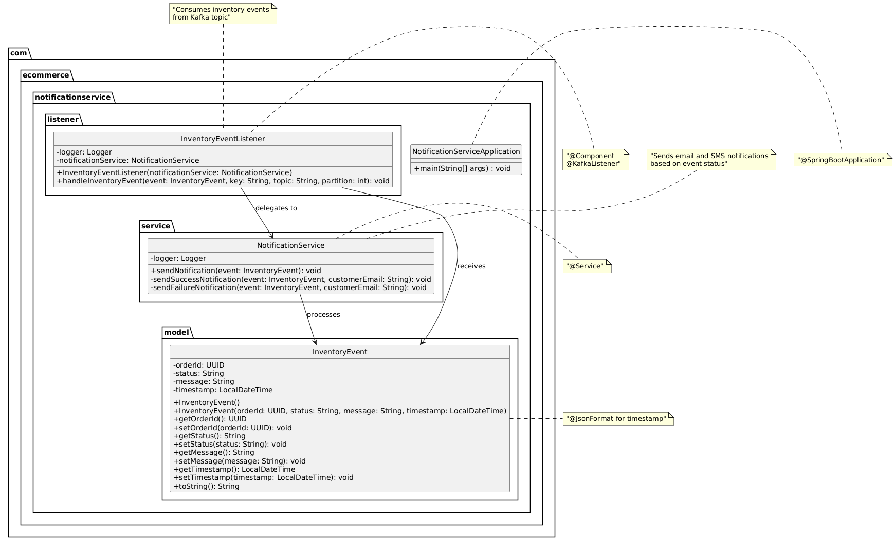
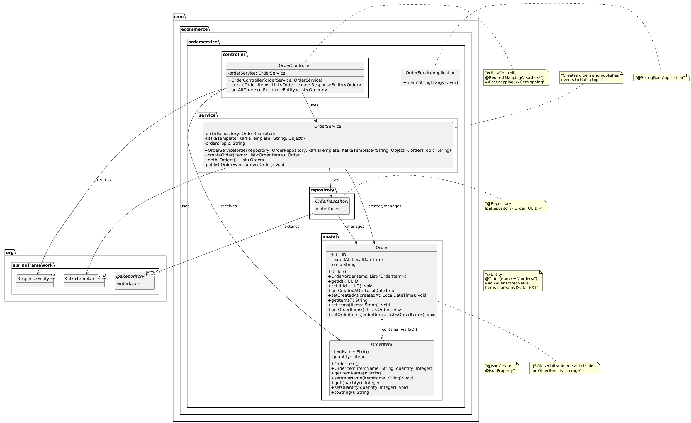

# 🛒 Sistema Distribuído de E-commerce com Apache Kafka

Um sistema distribuído de microsserviços construído com Java Spring Boot , Apache Kafka e naco postgres para uma plataforma de e-commerce.

---

## 👥 Integrantes da Equipe

- 👨‍💻 [Leonardo Moreira] - [202201700]  
- 👨‍💻 [Samuel Jose Alves] - [202201712]  
- 👨‍💻 [Vitor Martins Castanheira] - [202201717]  

---

## 🧱 Visão Geral da Arquitetura

Este projeto implementa um sistema distribuído com três microsserviços:

1. 📝 **Order-Service** (Produtor) - API REST para criação de pedidos  
2. 📦 **Inventory-Service** (Consumidor + Produtor) - Processa pedidos e gerencia o estoque  
3. 🔔 **Notification-Service** (Consumidor) - Envia notificações com base em eventos de estoque

### 🔄 Fluxo de Mensagens

```
Order-Service → [tópico orders] → Inventory-Service → [tópico inventory-events] → Notification-Service
```

---

## 🛠️ Tecnologias Utilizadas

- ☕ **Java 17**  
- ⚙️ **Spring Boot 3.1.5**  
- 🐘 **Apache Kafka** (com Zookeeper)  
- 🐬 **PostgreSQL**  
- 🐳 **Docker & Docker Compose**  
- 📦 **Maven**  
- 🧪 **DBeaver**

---

## 📂 Estrutura do Projeto

```
├── docker-compose.yml                 # Configuração da infraestrutura
├── sql/init.sql                      # Script de inicialização do banco de dados
├── create-topics.sh                  # Script de criação dos tópicos Kafka
├── order-service/                    # Microsserviço de pedidos
├── inventory-service/                # Microsserviço de estoque
├── notification-service/             # Microsserviço de notificações
└── README.md                         # Este arquivo
```

---

## 🚀 Primeiros Passos

### ✅ Pré-requisitos

- 🐳 Docker e Docker Compose  
- ☕ Java 17  

### ▶️ Executando o Sistema

1. 🔽 **Clonar o repositório**

```bash
git clone https://github.com/leonardo029/projeto-pratico-mensageria-em-java-scd-2025-1.git
cd projeto-pratico-mensageria-em-java-scd-2025-1
```

2. 📦 **Subir a infraestrutura e os microsserviços**

```bash
docker-compose up -d 
```

3. 🔍 **Verificar se os serviços estão rodando**

```bash
docker-compose ps
```

4. 🧵 **Criar os tópicos Kafka**

```bash
chmod +x create-topics.sh
./create-topics.sh
```

5. 📃 **Verificar se os tópicos foram criados**

```bash
docker exec -it kafka bash
kafka-topics --list --bootstrap-server localhost:9092
```

---

### 🧪 Testando o Sistema

| 🛍️ Nome do Produto | 📦 Quantidade disponível |
|--|--|
| Lápis | 55 |
| Borracha | 100 |
| Caderno | 75 |
| Bicicleta | 25 |
| Pasta | 80 |
| Mochila | 33 |
| Estojo | 45 |

📮 **Endpoint:**

```
POST http://localhost:8080/orders
```

📦 **Criar um pedido:**

```bash
curl -X POST http://localhost:8080/orders -H "Content-Type: application/json" -d '[
  {"itemName": "Estojo", "quantity": 7},
  {"itemName": "Pasta", "quantity": 3}
]'
```

📡 **Acompanhar logs:**

```bash
docker logs -f order-service
docker logs -f inventory-service
docker logs -f notification-service
```

📜 **Ver todos os pedidos:**

```bash
curl http://localhost:8080/orders
```

---

### 📋 Exemplos de Requisições

✅ **Pedido com sucesso:**

```bash
curl -X POST http://localhost:8080/orders -H "Content-Type: application/json" -d 
'[{"itemName": "Borracha", "quantity": 5}]'
```

❌ **Pedido com estoque insuficiente:**

```bash
curl -X POST http://localhost:8080/orders -H "Content-Type: application/json" -d 
'[{"itemName": "Lápis", "quantity": 100}]'
```

---

## 📐 Diagramas de Classes dos Serviços

  
  


---

## 🗃️ Esquema do Banco de Dados

### 🧾 Tabela `orders`

```sql
CREATE TABLE orders (
  id UUID PRIMARY KEY,
  created_at TIMESTAMP DEFAULT CURRENT_TIMESTAMP,
  items JSONB NOT NULL
);
```

### 📦 Tabela `inventory`

```sql
CREATE TABLE inventory (
  id SERIAL PRIMARY KEY,
  item_name VARCHAR(255) UNIQUE NOT NULL,
  quantity INTEGER NOT NULL DEFAULT 0,
  created_at TIMESTAMP DEFAULT CURRENT_TIMESTAMP,
  updated_at TIMESTAMP DEFAULT CURRENT_TIMESTAMP
);
```

---

## ⚙️ Funcionalidades do Sistema

### ✅ Requisitos Funcionais

- RF-1: Criação automática dos tópicos Kafka (`orders` e `inventory-events`)  
- RF-2: Order-Service fornece API REST (`POST /orders`) com UUID e timestamp  
- RF-3: Inventory-Service processa pedidos e publica eventos de sucesso/falha  
- RF-4: Notification-Service imprime notificações no console  

---

## 📈 Requisitos Não Funcionais

### 1️⃣ Escalabilidade

📖 **Definição**: Capacidade do sistema de lidar com aumento de carga mantendo desempenho e estabilidade.

🧩 **Como o Kafka permite escalar:**

- Partições → processamento paralelo  
- Grupos de consumidores → múltiplas instâncias trabalhando juntas  
- Cluster de brokers → distribuição e alta capacidade  

✅ **No projeto:**  
- Aumentamos partições do `orders`  
- Executamos várias instâncias do `Inventory-Service`

---

### 2️⃣ Tolerância à Falha

📖 **Definição**: Capacidade do sistema de continuar funcionando mesmo após falhas.

🛡️ **Kafka lida com falhas via:**

- Replicação de partições  
- Gerenciamento de offsets  
- Retries + dead-letter topics  

✅ **No projeto:**  
- Réplicas garantem continuidade mesmo com falhas de broker  
- Offset impede perda de progresso

---

### 3️⃣ Idempotência

📖 **Definição**: Operação gera o mesmo resultado mesmo se executada mais de uma vez.

🎯 **Como garantir:**

- `enable.idempotence=true`  
- Mensagens com `UUID`  
- Chave primária no banco

✅ **No projeto:**  
- Order-Service gera UUID  
- Inventory verifica duplicidade  
- Banco rejeita inserções duplicadas

---

### 🧾 Resumo Geral

| Conceito | Mecanismo no Kafka | Aplicação no Projeto |
|--|--|--|
| **Escalabilidade** | Partições + múltiplos consumidores | Escala Inventory-Service com mais partições e instâncias |
| **Tolerância à falha** | Replicação + offsets | Kafka mantém disponibilidade mesmo com falhas |
| **Idempotência** | Producer idempotente + UUID | Evita duplicidade de pedidos |

---

## 📊 Monitoramento e Logs

📦 **Todos os serviços:**

```bash
docker-compose logs -f
```

🔍 **Serviço específico:**

```bash
docker logs -f order-service
docker logs -f inventory-service
docker logs -f notification-service
```

---

## 🛠️ Solução de Problemas

### ⚠️ Problemas Comuns

1. 🚫 Serviços não iniciam → verifique portas 5432, 9092, 8080  
2. 🕒 Kafka demora a responder → aguarde até 60s  
3. ❌ Banco inacessível → cheque se o PostgreSQL está ativo  
4. 📭 Tópico ausente → execute `./create-topics.sh`

---

### 🧰 Comandos Úteis

```bash
# Reiniciar tudo
docker-compose down && docker-compose up -d

# Listar tópicos Kafka
docker exec kafka kafka-topics --list --bootstrap-server localhost:9092

# Consumir mensagens Kafka
docker exec kafka kafka-console-consumer --topic orders --bootstrap-server localhost:9092 --from-beginning

# Consultar banco
docker exec -it postgres-ecommerce psql -U postgres -d ecommerce -c "SELECT * FROM orders;"
docker exec -it postgres-ecommerce psql -U postgres -d ecommerce -c "SELECT * FROM inventory;"
```

---

## ✨ Destaques do Projeto

- ⚙️ Arquitetura orientada a eventos  
- 🧱 Padrão de microsserviços  
- 🗃️ Banco de dados por serviço  
- 🐳 Orquestração com Docker Compose  
- 🛡️ Alta tolerância a falhas com Kafka  
- 📈 Escalabilidade horizontal com partições e consumidores  

---

_Este projeto demonstra os conceitos principais de sistemas distribuídos, eventos e microsserviços com ferramentas padrão da indústria._ 💡
